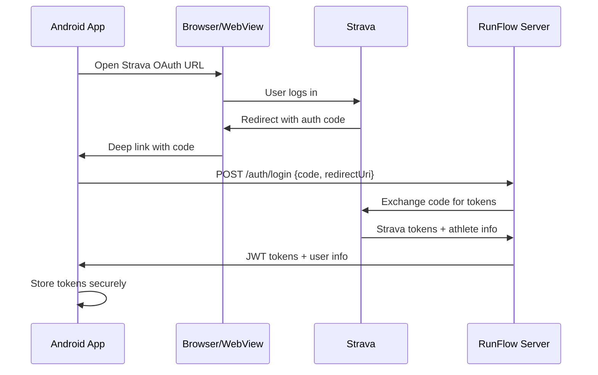

# RunFlow Mobile API Documentation

This document describes the REST API endpoints for the RunFlow Android mobile app.

## Base URL

```
https://your-domain.com/api/mobile
```

## Authentication

The mobile app uses JWT (JSON Web Token) authentication. After the user authenticates with Strava, the app exchanges the authorization code for JWT tokens.

### Authentication Flow



### Token Types

| Token | Expiry | Purpose |
|-------|--------|---------|
| Access Token | 24 hours | API request authentication |
| Refresh Token | 30 days | Obtain new access tokens |

### Request Headers

Include the access token in all authenticated requests:

```
Authorization: Bearer <access_token>
```

---

## Auth Endpoints

### POST /auth/login

Exchange Strava OAuth code for JWT tokens.

**Request:**
```json
{
  "code": "strava_authorization_code",
  "redirectUri": "runflow://auth/callback"
}
```

**Response (200):**
```json
{
  "accessToken": "eyJhbGciOiJIUzI1NiIs...",
  "refreshToken": "eyJhbGciOiJIUzI1NiIs...",
  "expiresIn": 86400,
  "tokenType": "Bearer",
  "user": {
    "id": "clm1234567890",
    "name": "John Doe",
    "email": null,
    "image": "https://dgalywyr863hv.cloudfront.net/..."
  }
}
```

**Errors:**
- `400` - Invalid request body
- `401` - Strava authentication failed
- `429` - Rate limit exceeded

---

### POST /auth/refresh

Refresh an expired access token.

**Request:**
```json
{
  "refreshToken": "eyJhbGciOiJIUzI1NiIs..."
}
```

**Response (200):**
```json
{
  "accessToken": "eyJhbGciOiJIUzI1NiIs...",
  "refreshToken": "eyJhbGciOiJIUzI1NiIs...",
  "expiresIn": 86400,
  "tokenType": "Bearer"
}
```

---

### POST /auth/logout

Log out (invalidate tokens - placeholder for future token blacklisting).

**Headers:** `Authorization: Bearer <access_token>`

**Response (200):**
```json
{
  "success": true,
  "message": "Logged out successfully"
}
```

---

## v1 API Endpoints

All data endpoints are under `/api/mobile/v1/`.

### GET /v1/dashboard

Get combined dashboard data (stats, activities, goals, sync status).

**Headers:** `Authorization: Bearer <access_token>`

**Response (200):**
```json
{
  "stats": {
    "currentWeekMileage": 45.2,
    "effectiveVO2max": 52.3,
    "rawVO2max": 54.1,
    "vdotCorrectionFactor": 0.95,
    "marathonShape": {
      "shape": 0.85,
      "mileageScore": 0.9,
      "longRunScore": 0.8,
      "crossTrainingScore": 0.7
    },
    "currentVdot": 50.5,
    "ctl": 65.2,
    "atl": 72.1,
    "tsb": -6.9,
    "workloadRatio": 1.1,
    "easyTrimp": 450,
    "hrMax": 185
  },
  "recentActivities": [...],
  "goals": [...],
  "syncStatus": {
    "syncInProgress": false,
    "lastSyncAt": "2024-01-15T10:30:00Z",
    "totalActivities": 250
  },
  "user": {
    "id": "clm1234567890",
    "name": "John Doe",
    "email": null,
    "image": "https://..."
  }
}
```

---

### GET /v1/activities

Get paginated list of activities.

**Headers:** `Authorization: Bearer <access_token>`

**Query Parameters:**
| Parameter | Type | Default | Description |
|-----------|------|---------|-------------|
| `limit` | int | 50 | Max 100 |
| `offset` | int | 0 | Pagination offset |
| `type` | string | - | Filter: RUN, RIDE, SWIM, etc. |

**Response (200):**
```json
{
  "activities": [
    {
      "id": "clm1234567890",
      "stravaId": "12345678901",
      "type": "RUN",
      "name": "Morning Run",
      "startDate": "2024-01-15T06:30:00Z",
      "distance": 10500,
      "movingTime": 3600,
      "averageSpeed": 2.92,
      "averageHr": 145,
      "hasHeartrate": true,
      "totalElevation": 120,
      "trainingType": "EASY"
    }
  ],
  "total": 250,
  "limit": 50,
  "offset": 0,
  "hasMore": true
}
```

---

### GET /v1/activities/:id

Get full activity details with streams.

**Headers:** `Authorization: Bearer <access_token>`

**Response (200):**
```json
{
  "activity": {
    "id": "clm1234567890",
    "stravaId": "12345678901",
    "type": "RUN",
    "name": "Morning Run",
    "description": "Easy recovery run",
    "startDate": "2024-01-15T06:30:00Z",
    "distance": 10500,
    "movingTime": 3600,
    "elapsedTime": 3720,
    "averageSpeed": 2.92,
    "maxSpeed": 4.2,
    "averageHr": 145,
    "maxHr": 165,
    "hasHeartrate": true,
    "totalElevation": 120,
    "streams": { ... }
  }
}
```

---

### POST /v1/sync

Trigger Strava activity sync.

**Headers:** `Authorization: Bearer <access_token>`

**Request:**
```json
{
  "range": "SINCE_LAST_ACTIVITY"  // or "LAST_7_DAYS", "ALL"
}
```

**Response (200):**
```json
{
  "success": true,
  "synced": 5,
  "created": 3,
  "updated": 2
}
```

---

### GET /v1/sync

Get sync status.

**Headers:** `Authorization: Bearer <access_token>`

**Response (200):**
```json
{
  "syncInProgress": false,
  "lastSyncAt": "2024-01-15T10:30:00Z",
  "totalActivities": 250
}
```

---

### GET /v1/goals

Get all training goals.

**Headers:** `Authorization: Bearer <access_token>`

**Response (200):**
```json
{
  "goals": [
    {
      "id": "clm1234567890",
      "name": "Berlin Marathon 2024",
      "raceType": "MARATHON",
      "raceDate": "2024-09-29T00:00:00Z",
      "targetTime": 12600,
      "currentVdot": 50.5,
      "isActive": true,
      "workouts": [...]
    }
  ]
}
```

---

### POST /v1/goals

Create a new goal.

**Headers:** `Authorization: Bearer <access_token>`

**Request:**
```json
{
  "name": "Berlin Marathon 2024",
  "raceType": "MARATHON",
  "raceDate": "2024-09-29T00:00:00Z",
  "targetTime": 12600,
  "calibrationTime": 1200,
  "calibrationDistance": "5K",
  "runsPerWeek": 5
}
```

---

### GET /v1/goals/:id

Get goal with all workouts.

---

### PUT /v1/goals/:id

Update goal.

---

### DELETE /v1/goals/:id

Delete goal.

---

### GET /v1/workouts

Get workouts for goals.

**Headers:** `Authorization: Bearer <access_token>`

**Query Parameters:**
| Parameter | Type | Description |
|-----------|------|-------------|
| `goalId` | string | Filter by goal |
| `weekStart` | ISO date | Week start date |
| `weekEnd` | ISO date | Week end date |

---

### GET /v1/analytics/stats

Get training analytics and fitness metrics.

**Headers:** `Authorization: Bearer <access_token>`

**Response (200):**
```json
{
  "currentWeekMileage": 45.2,
  "effectiveVO2max": 52.3,
  "rawVO2max": 54.1,
  "vdotCorrectionFactor": 0.95,
  "marathonShape": {...},
  "currentVdot": 50.5,
  "ctl": 65.2,
  "atl": 72.1,
  "tsb": -6.9,
  "workloadRatio": 1.1,
  "easyTrimp": 450,
  "hrMax": 185
}
```

---

### GET /v1/user/profile

Get user profile.

**Headers:** `Authorization: Bearer <access_token>`

**Response (200):**
```json
{
  "user": {
    "id": "clm1234567890",
    "email": null,
    "name": "John Doe",
    "image": "https://...",
    "sex": "MALE",
    "birthDate": "1990-05-15T00:00:00Z",
    "hrMax": 185,
    "hrRest": 50,
    "weight": 70.5,
    "height": 178,
    "vdotCorrectionFactor": 0.95
  }
}
```

---

### PUT /v1/user/profile

Update user profile.

**Headers:** `Authorization: Bearer <access_token>`

**Request:**
```json
{
  "name": "John Doe",
  "sex": "MALE",
  "hrMax": 185,
  "weight": 70.5
}
```

---

## Error Responses

All endpoints return errors in this format:

```json
{
  "error": "Error message description"
}
```

### HTTP Status Codes

| Code | Description |
|------|-------------|
| 200 | Success |
| 400 | Bad request (validation error) |
| 401 | Unauthorized (invalid/expired token) |
| 403 | Forbidden (no access to resource) |
| 404 | Not found |
| 409 | Conflict (e.g., sync in progress) |
| 429 | Rate limit exceeded |
| 500 | Internal server error |

---

## Rate Limits

| Endpoint Category | Limit |
|------------------|-------|
| Auth (login/refresh) | 10/minute |
| Sync | 5/minute |
| Activities | 30/minute |
| Settings | 10/minute |
| General | 60/minute |

Rate limit headers are included in responses:
- `X-RateLimit-Limit`: Max requests per window
- `X-RateLimit-Remaining`: Remaining requests
- `X-RateLimit-Reset`: Unix timestamp when limit resets

---

## Strava OAuth Configuration

For the Android app, configure Strava OAuth:

1. **Authorization URL:**
   ```
   https://www.strava.com/oauth/authorize
   ```

2. **Required Parameters:**
   - `client_id`: Your Strava app client ID
   - `redirect_uri`: `runflow://auth/callback` (deep link)
   - `response_type`: `code`
   - `scope`: `read,activity:read_all,profile:read_all`

3. **Deep Link Registration:**
   Register `runflow://auth/callback` in your Android manifest.

4. **Token Exchange:**
   After receiving the code via deep link, call `POST /api/mobile/auth/login`.
