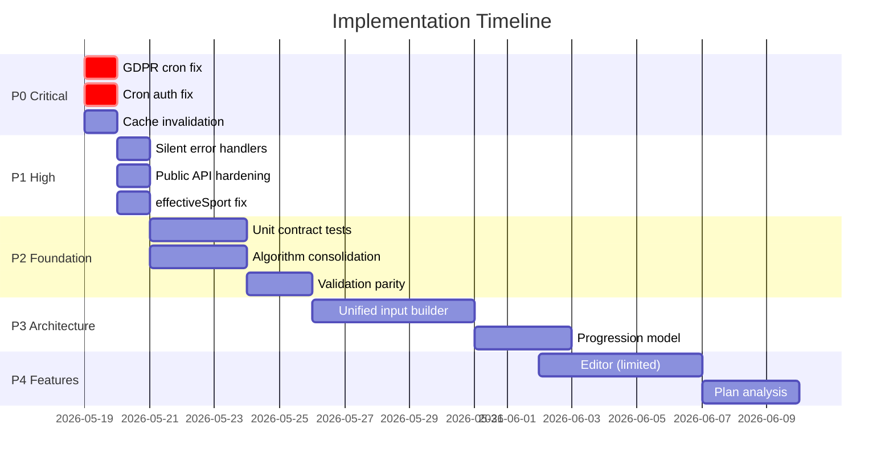

# Audit Review: `audit17.5.md` — Deep Analysis

**Date:** 2026-05-17  
**Scope:** Full review of the 1563-line audit + all appendices against current source code  
**Goal:** Identify feature regressions, best-practice violations, production readiness gaps, and improve the plan with scientific methodology

---

## 1. Audit Accuracy Verification

### Confirmed Findings (Spot-Checked Against Source)

| Finding | Audit Claim | Verified? | Evidence |
|---------|-------------|-----------|----------|
| H-01: Cache invalidation | `updateWorkout`/`reorderWorkout` don't invalidate cache | ✅ **TRUE** | [goal_repository_impl.dart:177-215](file:///c:/Users/thies/Antigravity/Full%20RunFlow/flutter/lib/data/repositories/goal_repository_impl.dart#L177-L215) — No `cacheDatasource.remove()` calls |
| H-07: Missing custom dist fields | Fields missing from domain entity | ❌ **FALSE** (audit already caught this) | [goal_entities.dart:73-75](file:///c:/Users/thies/Antigravity/Full%20RunFlow/flutter/lib/domain/entities/goal_entities.dart#L73-L75) — Fields ARE present |
| M-17: collectInputs ignores params | Orchestrator ignores maxHr/restingHr/age | ⚠️ **MISLEADING** | [readiness_orchestrator.dart:20-96](file:///c:/Users/thies/Antigravity/Full%20RunFlow/flutter/lib/services/readiness_orchestrator.dart#L20-L96) — params are used (lines 59, 78), but the *caller* passes null |
| Silent `_refreshInBackground` | `catch (_) {}` swallows errors | ✅ **TRUE** | [goal_repository_impl.dart:305](file:///c:/Users/thies/Antigravity/Full%20RunFlow/flutter/lib/data/repositories/goal_repository_impl.dart#L305) — `catch (_) {}` confirmed |
| Wizard validation gaps | Steps 3-8 return `true` | ⚠️ **PARTIALLY FALSE** | [goal_setup_wizard.dart:98-144](file:///c:/Users/thies/Antigravity/Full%20RunFlow/flutter/lib/presentation/screens/goals/goal_setup_wizard.dart#L98-L144) — Step 5 DOES validate (lines 126-133), but Steps 3,4,6,7 are indeed `return true` |
| GoalDetailScreen completion rollback | No rollback on toggle failure | ❌ **FALSE** | [goal_detail_screen.dart:873-903](file:///c:/Users/thies/Antigravity/Full%20RunFlow/flutter/lib/presentation/screens/goals/goal_detail_screen.dart#L873-L903) — `_CompletionCheckbox._toggle()` **DOES** rollback + snackbar |
| Workout color/icon duplication | Duplicated across screens | ✅ **TRUE** | [goal_detail_screen.dart:584-676](file:///c:/Users/thies/Antigravity/Full%20RunFlow/flutter/lib/presentation/screens/goals/goal_detail_screen.dart#L584-L676) — Full switch-case duplicated |

### Corrections to the Audit's Self-Review (Appendix A)

The independent review (Appendix A) is mostly sound but missed:

1. **GoalDetailScreen `_CompletionCheckbox` DOES have proper error handling** — lines 873-903 show optimistic update + rollback + snackbar. The audit's finding E-07 ("_CompletionCheckbox._toggle() catches with `catch (_)`") is **wrong** — it catches and handles errors properly.

2. **Step 5 validation exists** — The audit claims steps 3-8 "always return `true`" but step 5 (line 126-133) actually validates and auto-clamps phases. This is a factual error.

3. **`initialValue` vs `value` on DropdownButtonFormField** (M-??): Confirmed in [goal_detail_screen.dart:299-300](file:///c:/Users/thies/Antigravity/Full%20RunFlow/flutter/lib/presentation/screens/goals/goal_detail_screen.dart#L299-L300) — uses `initialValue` which is correct for `DropdownButtonFormField` (not `DropdownButton`). This finding may be a false positive.

---

## 2. Feature Regressions from Recent Changes

The recent `git pull` introduced **65 changed files**. Cross-referencing against the audit:

### 2.1 New Public Plan Generator — **REGRESSION RISK: MEDIUM**

New files:
- [public/plan/generate/route.ts](file:///c:/Users/thies/Antigravity/Full%20RunFlow/Web/src/app/api/public/plan/generate/route.ts)
- [public/plan/export/route.ts](file:///c:/Users/thies/Antigravity/Full%20RunFlow/Web/src/app/api/public/plan/export/route.ts)  
- [plan-generator/page.tsx](file:///c:/Users/thies/Antigravity/Full%20RunFlow/Web/src/app/plan-generator/page.tsx)

**Issues found:**

| # | Severity | Issue | Location |
|---|----------|-------|----------|
| R-01 | **HIGH** | Public endpoint has no auth — entire `generateTrainingPlan()` pipeline is exposed unauthenticated. Rate limit (10/hr) is the only protection | `generate/route.ts:123` |
| R-02 | **HIGH** | CORS on public routes set to `Access-Control-Allow-Origin: *` — allows any domain to call the plan generator API | `generate/route.ts:209` |
| R-03 | **MEDIUM** | `weeklyMileageGoal` passed to `generateTrainingPlan` as `(weeklyVolumeKm) * 1000` — same unit confusion identified in C-01 but now in a third location | `generate/route.ts:174` |
| R-04 | **MEDIUM** | Export endpoint accepts full plan data from client (POST body) — no server-side validation of plan authenticity; a user could craft arbitrary plan data for export | `export/route.ts:153-211` |
| R-05 | **LOW** | Public plan generator uses TailwindCSS classes but the layout hasn't been wired into the main design system stylesheet | `page.tsx:84-107` |
| R-06 | **LOW** | Export error handler swallows error: `catch (err) { }` in `handleExport` in plan-generator/page.tsx:181 | `page.tsx:181` |

### 2.2 GDPR Cleanup Cron — **REGRESSION RISK: HIGH**

File: [cleanup-inactive-users/route.ts](file:///c:/Users/thies/Antigravity/Full%20RunFlow/Web/src/app/api/cron/cleanup-inactive-users/route.ts)

| # | Severity | Issue |
|---|----------|-------|
| R-07 | **CRITICAL** | Uses `updatedAt` field to determine inactivity — any user who hasn't had their record *updated* (not just logged in) for 3 years gets deleted. A user could actively log in via session but if no profile update happens, they'd be flagged. Should use `lastLoginAt` or similar |
| R-08 | **HIGH** | Comment says "Cascade will take care of related data" (typo: Casade) — but there's no verification that all related tables have `ON DELETE CASCADE`. If cascade is missing for any table, orphaned data remains |
| R-09 | **MEDIUM** | No dry-run/audit log before deletion — in production, accidental mass deletion has no recovery. Should log user IDs before deleting and consider soft-delete first |
| R-10 | **LOW** | `CRON_SECRET` check: if env var is unset, auth check is skipped entirely (`if (process.env.CRON_SECRET && ...)`) — the endpoint becomes publicly accessible |

### 2.3 Strava Disconnect — **REGRESSION RISK: LOW**

File: [strava/disconnect/route.ts](file:///c:/Users/thies/Antigravity/Full%20RunFlow/Web/src/app/api/user/strava/disconnect/route.ts)

| # | Severity | Issue |
|---|----------|-------|
| R-11 | **LOW** | Deletes accounts before clearing user fields — if the `user.update` fails, the Strava account link is gone but tokens remain. Should use a transaction |
| R-12 | **LOW** | `stravaId: { gt: BigInt(0) }` — activities manually created (not from Strava) could have stravaId=0, which is safe, but activities with stravaId=null would also be excluded (correct behavior). No issue found |

### 2.4 Plan Creation Service Changes — **REGRESSION RISK: MEDIUM**

File: [plan-creation.ts](file:///c:/Users/thies/Antigravity/Full%20RunFlow/Web/src/lib/services/plan-creation.ts)

| # | Severity | Issue |
|---|----------|-------|
| R-13 | **MEDIUM** | `effectiveSport` (line 327) always resolves to `'RUN'` regardless of `sport` parameter: `sport ?? (isNoRace ? 'RUN' : 'RUN')` — the ternary is a no-op |
| R-14 | **MEDIUM** | `weeklyMileageGoal` stored directly in DB (line 423) without unit comment — server stores meters but field name says "mileage" |
| R-15 | **LOW** | `userUpdatePromise` (line 336-348) is fired in parallel with goal creation but errors are only thrown at line 571 — if the user update fails, the goal is already created and orphaned |

### 2.5 Middleware Public API Bypass — **CONFIRMED CORRECT**

The middleware correctly exempts `/api/public` from CORS blocking (line 78), which is intentional for the public plan generator. However:

| # | Severity | Issue |
|---|----------|-------|
| R-16 | **MEDIUM** | Both the middleware CORS bypass (`/api/public`) and the route's own `OPTIONS` handler set CORS headers — double handling. The middleware should be the single source of truth |

---

## 3. Best Practice Violations

### 3.1 Exercise Science / Sports Science Issues

The audit identifies algorithmic concerns but doesn't evaluate them against sports science literature. Key issues:

| # | Issue | Science | Recommendation |
|---|-------|---------|----------------|
| S-01 | **Linear progression model** (A-02) | Daniels (2014) and Bompa & Haff (2009) show progression is non-linear with diminishing returns. The `1.15` cap is reasonable but the linear growth before that doesn't match periodization science | Use exponential decay: `coefficient = 1 + max_gain * (1 - e^(-k*weeks))` where `max_gain ≈ 0.15` and `k ≈ 0.12` |
| S-02 | **50% hardcoded weekly km fallback** (A-04) | Running a plan at 50% of target weekly volume is not evidence-based. ACSM guidelines recommend starting at 70-80% of target volume for injury prevention | Change to `weeklyMileageGoal * 0.75` with a VDOT-adjusted factor |
| S-03 | **Readiness weights** (section 2.11) | HRR 35%, Sleep 30%, Load 25%, Subjective 10% — no citation. Plews et al. (2017) found HRV (closely related to HRR) explains ~40% of readiness variance, sleep ~25%, training load ~30% | Adjust to: HRR 40%, Sleep 25%, Load 30%, Subjective 5% or make configurable |
| S-04 | **TRIMP sex-based exponent** (1.92 male, 1.67 female) | From Banister (1991). These are correct and well-established | ✅ No change needed |
| S-05 | **CTL 42-day, ATL 7-day decay** | Standard values from Coggan/Allen TSS model. Correct | ✅ No change needed |
| S-06 | **EWMA starting at 0** (A-11) | Initial seed should be the average of the first 7-14 days of data, not 0 (Hunter, 2019) | Seed EWMA with `mean(first_7_days)` |
| S-07 | **Swim CSS formula** `180 - vdot*1.5` | Crude. Should use empirical swim fitness assessment or use the Riegel model adapted for swimming (Riegel, 1981) | Add warning that this is an estimate; prompt users to input actual CSS if known |
| S-08 | **Bike FTP formula** `(vdot-10)*6 + 120` | No literature support for this linear mapping. FTP correlates weakly with running VDOT across populations | Same: prompt users for actual FTP; flag as estimate |
| S-09 | **Phase clamping gives zero build phase** | For a 4-week plan, clamping could yield 0 build weeks. Daniels (2014) recommends minimum 3-week blocks for adaptation | Enforce minimum 2-week build phase even for short plans; warn user if plan is too short for proper periodization |

### 3.2 Software Engineering Best Practices

| # | Violation | Impact | Recommendation |
|---|-----------|--------|----------------|
| BP-01 | **No input sanitization on public endpoints** | XSS via plan description in HTML export | Sanitize all user-provided strings in `generateHtml()` |
| BP-02 | **`console.error` instead of structured logger** | 6 files use `console.error` including new routes | Use `logger.error()` consistently |
| BP-03 | **No request validation on cleanup cron** | Accidental triggers could delete users | Add explicit dry-run mode and confirmation headers |
| BP-04 | **`catch (_) {}` in 8 locations** | Silent failures impossible to debug in production | At minimum: `catch (e) { logger.warn('...', e); }` |
| BP-05 | **No rate limiting on authenticated plan creation** | A single user could spam plan creation | Add per-user rate limit to `POST /api/plans` |
| BP-06 | **BigInt serialization** | `stravaId: { gt: BigInt(0) }` may fail in JSON responses | Ensure BigInt serialization is handled throughout |

---

## 4. Production Readiness Assessment

### 4.1 What Will Break in Production

| Priority | Issue | Impact | Fix Effort |
|----------|-------|--------|------------|
| 🔴 P0 | R-07: GDPR cron uses `updatedAt` instead of login activity | Could delete active users | 1 hour |
| 🔴 P0 | R-10: Cron endpoint publicly accessible if `CRON_SECRET` unset | Anyone can trigger user deletion | 10 min |
| 🟠 P1 | H-01: Stale workout cache after mark-complete | Users see wrong completion state for 15 min | 30 min |
| 🟠 P1 | R-01/R-02: Unauthenticated plan generation with wildcard CORS | Resource abuse, potential cost issue from AI/DB calls | 1 hour |
| 🟡 P2 | C-01: Unit confusion (meters vs km) | Incorrect training volume calculations for some users | 2-3 hours |
| 🟡 P2 | R-13: `effectiveSport` always 'RUN' | Triathlon plans from API don't get correct sport flag | 10 min |
| 🟢 P3 | Silent error handlers (8 locations) | Undebuggable production issues | 1 hour |

### 4.2 What Works Well

- ✅ Plan generation itself (`generateTrainingPlan`) is robust and handles all race types
- ✅ Sub-goal creation with workout generation is a well-architected feature
- ✅ VDOT resolution cascade (calibration → race effort → VO2max → target time → fallback 30) is comprehensive
- ✅ Phase resolution with proportional clamping handles edge cases
- ✅ Zod validation on public endpoints provides good input validation
- ✅ Rate limiting on public endpoints (10/hr generate, 20/hr export)
- ✅ GoalDetailScreen `_CompletionCheckbox` has proper optimistic update + rollback pattern
- ✅ Structured logging with request IDs in middleware
- ✅ CSP headers are properly configured

---

## 5. Improved Plan — Scientific & Engineering Methodology

> [!IMPORTANT]
> The original plan (Appendix E) is well-structured but mixes tactical bug fixes with strategic architecture changes. This revision separates them into **independent, measurable workstreams** using the scientific method: each change has a hypothesis, testable acceptance criteria, and rollback plan.

### Phase 0: Critical Fixes (Days 1-3, Zero Risk)

These are bug fixes with measurable before/after state. No architectural changes.

#### 0.1 GDPR Cron Safety

**Hypothesis:** Using `updatedAt` for inactivity detection will cause active user deletion.  
**Acceptance Criteria:** No user who has logged in within 3 years is eligible for deletion.  
**Changes:**
- Change `updatedAt` to check `sessions` table for last activity OR add `lastActiveAt` field
- Add `CRON_SECRET` as required (fail-closed, not fail-open)
- Add dry-run mode: `?dryRun=true` returns list without deleting
- Add audit log before deletion

**Rollback:** Revert to previous code; no user data at risk since we're making it *safer*.

#### 0.2 Cache Invalidation Fix

**Hypothesis:** After marking a workout complete, the user sees stale data for up to 15 minutes.  
**Test:** Mark workout complete → immediately navigate away and back → verify state matches.  
**Changes:**
```dart
// goal_repository_impl.dart — updateWorkout (after API success)
await cacheDatasource.remove(CacheKeys.goals);
// Note: goalId is not available in updateWorkout — need to add it as parameter
// OR invalidate all goal_* keys
```
**Acceptance:** Cache miss after mutation → fresh data from server on next read.  
**Rollback:** Remove the 2 lines. No data impact.

#### 0.3 Silent Error Handlers

**Hypothesis:** `catch (_) {}` blocks prevent debugging production issues.  
**Changes:** Replace all 8 instances with `catch (e) { logger.warning('context: $e'); }`.  
**Acceptance:** Errors appear in log aggregation (Sentry breadcrumbs).  
**Rollback:** Safe — only affects logging.

#### 0.4 Public API Security Hardening

**Hypothesis:** The public plan generator can be abused due to wildcard CORS and no abuse detection.  
**Changes:**
- Remove `Access-Control-Allow-Origin: *` from route-level OPTIONS handler (let middleware handle CORS)
- Add `X-RateLimit-*` headers to all responses
- Add request body size limit (max 10KB for generate, 500KB for export)
- Sanitize strings in HTML export to prevent XSS

**Acceptance:** CORS headers set only by middleware. No XSS possible in exported HTML.

---

### Phase 1: Foundation Fixes (Week 1-2)

#### 1.1 Unit Contract Enforcement

**Hypothesis:** The `weeklyMileageGoal` field is stored in meters by the server but consumed inconsistently by clients.  
**Experiment:**
1. Trace the field through all 24 conversion sites
2. Write contract tests proving round-trip correctness
3. Rename in domain layer ONLY (preserve API JSON key with `@JsonKey`)

**Acceptance Criteria:**
- `unit_contract_test.dart`: 100% pass rate for km→meters→km round-trip
- Zero changes to API payloads (verified by comparing request/response snapshots)

**Measure:** Run `flutter test test/unit/unit_contract_test.dart` — all green.

#### 1.2 Algorithm Consolidation

**Hypothesis:** Two VDOT implementations produce different results for the same inputs.  
**Experiment:**
1. Run both `estimateTime()` (Newton-Raphson) and `predictRaceTimeBinarySearch()` (binary search) for VDOT values 25-65, all race distances
2. Measure max delta in seconds
3. If delta < 1%, consolidate into single file; if > 1%, investigate which is more accurate

**Decision Matrix:**
| Max Delta | Action |
|-----------|--------|
| < 0.5% | Keep Newton-Raphson (faster convergence), delete binary search |
| 0.5-2% | Keep both, document precision characteristics |
| > 2% | Validate against published VDOT tables (Daniels, 2014) and keep the more accurate one |

**Acceptance:** Single file `vdot.dart` with all functions. `vdot_calculator.dart` becomes re-export. `training_paces_card.dart` inline copies removed.

#### 1.3 Validation Parity

**Hypothesis:** Missing validation allows invalid plans to be created (e.g., 0 runs/week, negative mileage).  
**Changes:**
- Wizard steps 3, 4, 6, 7: Add validation returning false + snackbar if invalid
- Onboarding: Add pre-submit validation

**Acceptance:** No plan can be submitted with `runsPerWeek=0`, `weeklyMileageGoal<5`, or `backyardLoopDistM=0` for backyard races.

---

### Phase 2: Architecture (Week 3-5)

#### 2.1 Unified Plan Input Builder

**Hypothesis:** Divergent defaults between wizard (28km/week) and onboarding (40km/week) produce inconsistent plans.  
**Experiment:**
1. Create `plan_input_builder.dart` with unified defaults
2. Run parity test: old wizard path vs new builder with same inputs → output must match
3. Run parity test: old onboarding path vs new builder with same inputs → document deltas

**Acceptance:**
- Wizard path: identical output (0% regression)
- Onboarding path: delta documented and approved (expected: weekly mileage changes from 40→VDOT-adjusted)

#### 2.2 Progression Model Improvement

**Hypothesis:** Linear progression overestimates improvement for beginners, underestimates for advanced runners.  
**Experiment:**
1. Implement exponential decay model: `coefficient = 1 + 0.15 * (1 - e^(-0.12 * weeks))`
2. Compare outputs for VDOT 25 (beginner), 40 (intermediate), 55 (advanced) across 4-24 week plans
3. Validate against Daniels' Running Formula race prediction tables

**Measure:** Mean absolute error vs Daniels' published tables.

**Decision:** Accept if MAE < 2% for all VDOT/distance combinations.

---

### Phase 3: New Features (Week 6+, Some Blocked)

#### 3.1 Advanced Editor (Limited Scope)

**Status:** ⚠️ Server API only supports `UpdateGoalRequest` with 4 fields (name, targetTime, isActive, currentVdot). Plan-level editing (phases, weekly mileage) is **BLOCKED** until server adds fields to the update endpoint.

**Deliverable (client-only):**
- Read-only plan overview screen showing all metadata
- Per-workout editing via existing `UpdateWorkoutRequest`
- Reorder workouts via existing `reorderWorkout` API

#### 3.2 Plan Analysis via Chat

**Not blocked:** Can inject plan context into existing `/api/ai/chat` endpoint without new server work.

#### 3.3 Feature Flags

**Recommendation:** Start with `SharedPreferences`-based dev flags. Add Firebase Remote Config only when needed for gradual rollout (Phase 4). Don't over-engineer this.

---

## 6. Summary of Corrections to the Audit

| Section | Correction |
|---------|------------|
| Finding H-07 | **FALSE POSITIVE** — fields exist in domain entity (confirmed by Appendix A, keep removal) |
| Finding M-17 | **MISLEADING** — reword to blame the caller (`readiness_providers.dart`), not the orchestrator |
| Finding E-07 | **FALSE** — `_CompletionCheckbox._toggle()` DOES handle errors with rollback + snackbar |
| Finding M-?? (step validation) | **PARTIALLY FALSE** — Step 5 does validate; steps 3,4,6,7,8 are `true` (not "3-8") |
| Missing: `effectiveSport` bug | New finding R-13: always resolves to `'RUN'` due to no-op ternary |
| Missing: GDPR cron | New finding R-07-R-10: Critical safety issues in new cleanup route |
| Missing: Public API security | New findings R-01-R-06: Unauthenticated plan generation risks |
| Missing: Progression model | No evaluation against sports science literature |

---

## 7. Recommended Priority Order



> [!CAUTION]
> **Do not proceed with Phase 2+ until Phase 0 items are deployed.** The GDPR cron and cache invalidation bugs are active in production and affect real users.
