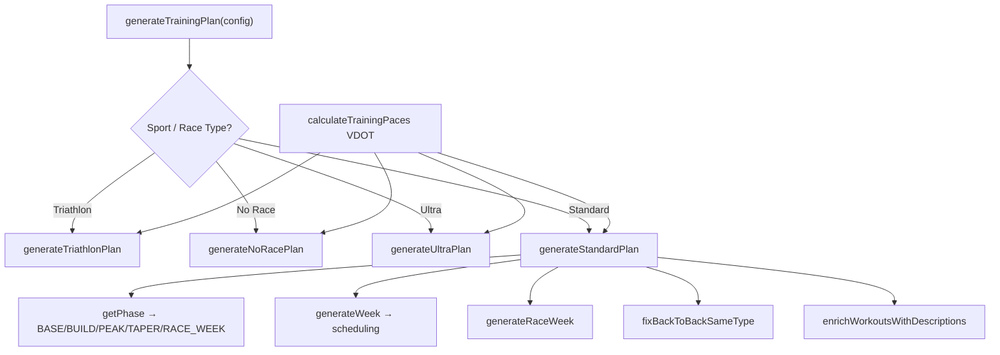

# Training Plan Generation — Comprehensive Audit

## Executive Summary

RunFlow's training plan generator is a **well-architected, Daniels-inspired periodization engine** that covers a remarkably wide surface area: 5K through 100-miler, triathlon (sprint→Ironman), backyard ultra, timed events, no-race general fitness, and multi-goal orchestration. The core logic is sound and demonstrates genuine coaching knowledge.

**Overall Grade: B+ / Very Good**

The system handles most common scenarios correctly and has clear evidence of iterative refinement (the test suite alone is 1,200+ lines). However, several edge cases remain unhandled, some workout progression logic is overly simplistic compared to SOTA, and a few areas carry latent bugs.

---

## 1. Architecture Overview



### Key Components

| File | Lines | Purpose |
|------|-------|---------|
| [index.ts](file:///c:/Users/thies/Antigravity/Full%20RunFlow/Web/src/lib/plans/index.ts) | 1,864 | Standard plan + shared utilities |
| [run-ultra.ts](file:///c:/Users/thies/Antigravity/Full%20RunFlow/Web/src/lib/plans/generators/run-ultra.ts) | 722 | Ultra/backyard/timed event plans |
| [triathlon.ts](file:///c:/Users/thies/Antigravity/Full%20RunFlow/Web/src/lib/plans/generators/triathlon.ts) | 738 | Multi-sport triathlon plans |
| [no-race.ts](file:///c:/Users/thies/Antigravity/Full%20RunFlow/Web/src/lib/plans/generators/no-race.ts) | 372 | General fitness / no goal race |
| [multi-goal.ts](file:///c:/Users/thies/Antigravity/Full%20RunFlow/Web/src/lib/plans/generators/multi-goal.ts) | 301 | Multi-race season orchestration |
| [ai-proposal.ts](file:///c:/Users/thies/Antigravity/Full%20RunFlow/Web/src/lib/plans/generators/ai-proposal.ts) | 271 | AI-powered plan proposals |
| [descriptions.ts](file:///c:/Users/thies/Antigravity/Full%20RunFlow/Web/src/lib/plans/descriptions.ts) | 267 | Display description generation |
| [defaults.ts](file:///c:/Users/thies/Antigravity/Full%20RunFlow/Web/src/lib/plans/defaults.ts) | 128 | Per-distance defaults |
| [schedule-utils.ts](file:///c:/Users/thies/Antigravity/Full%20RunFlow/Web/src/lib/plans/schedule-utils.ts) | 93 | Back-to-back fix post-processing |
| [validate-workout.ts](file:///c:/Users/thies/Antigravity/Full%20RunFlow/Web/src/lib/plans/validate-workout.ts) | 82 | Distance/pace/duration consistency |
| [index.test.ts](file:///c:/Users/thies/Antigravity/Full%20RunFlow/Web/src/lib/plans/__tests__/index.test.ts) | 1,237 | Comprehensive test suite |

---

## 2. What's Done Well ✅

### 2.1 Periodization Model
- **Phase-based progression** (BASE → BUILD → PEAK → TAPER → RACE_WEEK) correctly implemented
- **Configurable phase lengths** (`taperWeeks`, `peakWeeks`, `buildWeeks`) with sensible defaults per distance
- **Step loading** (3:1 hard:recovery cycle via `STEP_LOADING_CYCLE = 4`) is textbook Daniels
- **Exponential taper** using decay rates calibrated per race distance — this is genuinely SOTA (mirrors Mujika & Padilla 2003)

### 2.2 Pace-Based Training (Daniels/VDOT)
- Five training zones correctly derived from VDOT: Easy, Marathon, Threshold, Interval, Repetition
- Zone-appropriate workout assignment: 5K→Intervals/Reps, 10K→Intervals+Threshold, HM/Marathon→Threshold+MP
- Fartlek pace correctly computed as midpoint of Threshold and Interval zones

### 2.3 Volume Management
- **10% weekly growth cap** (`WEEKLY_GROWTH_CAP = 1.10`) — universally accepted safety rule
- **Dynamic long run caps** per distance with time-on-feet ceiling (3.5h standard, 7h ultra)
- **Low-volume runners** get higher long run ratio (`0.65` vs `0.50`) — smart adaptation
- **Volume scaling** preserves priority workouts (quality > easy runs) when cap is hit

### 2.4 Scheduling Intelligence
- **MIN_GAP_DAYS = 2** between hard sessions enforced with wrap-around day logic
- **Recovery runs** auto-placed after hard days at slower pace
- **Rest day exclusion** prevents workouts on user-designated rest days
- **Cross-training placement** avoids conflicting with key run days
- **Strength training** smartly stacked on easy/recovery run days rather than competing for slots

### 2.5 Ultra-Specific Features
- **Back-to-back long runs** in ENDURANCE/PEAK phases — essential for ultra prep
- **Night runs** during MENTAL_PREP phase for backyard ultra — very creative
- **Ultra-easy pace** (110% of easy max) — shows understanding of ultra pacing
- **Fueling practice** callouts in long run descriptions

### 2.6 Triathlon Support
- **Sport distribution ratios** per race type (e.g., Full Ironman: 55% bike, 25% run, 8% swim)
- **Brick sessions**, **open water swims**, **transition practice** all generated
- **Bike FTP zones** and **swim CSS** derived from VDOT
- **Long ride duration** scaled by phase with proper taper reduction

### 2.7 Test Coverage
- 55,000+ bytes of tests covering critical path, edge cases, phase progression, caps
- Tests verify: paces, taper volumes, 48h gap, recovery run placement, scaling, short plans

---

## 3. Edge Cases & Bugs 🐛

### 3.1 CRITICAL: Possible Infinite Loop in `fixBackToBackSameType`

```typescript
// schedule-utils.ts L87-88
sorted.sort((a, b) => a.date.getTime() - b.date.getTime());
i = Math.max(1, i - 1);
```

> [!CAUTION]
> If no swap candidate is found and the shift fallback also fails (e.g., all days occupied, or rest days block it), `changed` stays `false`, `i` increments by 1, but the same pair can be re-evaluated after sorting. In adversarial inputs (many rest days, dense schedules), this could loop excessively. No iteration cap exists.

**Recommendation**: Add a `maxIterations` guard (e.g., `workouts.length * 3`).

---

### 3.2 HIGH: `CUSTOM_DISTANCE` Without `customRunDistM` Falls Through Silently

In [index.ts L1058-1068](file:///c:/Users/thies/Antigravity/Full%20RunFlow/Web/src/lib/plans/index.ts#L1058-L1068):
```typescript
if (raceType === 'CUSTOM_DISTANCE' && customRunDistM) {
    // ... routes to 5K/10K/HM/Marathon quality session
}
return scale(getMarathonQualitySession(paces, phase, weekNumber));
```

If `customRunDistM` is `0` or `undefined`, a custom 3km race would get **Marathon quality sessions** (10km+ threshold runs). This is nonsensical.

**Recommendation**: Default `customRunDistM` to `10000` if not provided, or route to a generic intermediate session.

---

### 3.3 HIGH: `getRaceDistanceMeters` Returns 0 for Unknown Types

For `CUSTOM_DISTANCE` without `customRunDistM`, [getRaceDistanceMeters returns 0](file:///c:/Users/thies/Antigravity/Full%20RunFlow/Web/src/lib/plans/index.ts#L1674). This flows into `getRaceWeekRunVolumeCap` which then does `Math.max(half_peak * 0.5, 0 + 10000)` → only `10000m`. Seems accidentally correct but fragile.

---

### 3.4 HIGH: No-Race Plan Has No Workout Variation Over Time

In [no-race.ts](file:///c:/Users/thies/Antigravity/Full%20RunFlow/Web/src/lib/plans/generators/no-race.ts), the quality session is always either:
- BASE: `Fartlek: 8km (3min hard / 2min easy)` — same description every week
- BUILD: `Threshold: 6km @ T` — same description every week

There's **no week rotation** like the standard plan has. This makes weeks of the plan feel identical.

---

### 3.5 MEDIUM: `startDate > raceDate` Guard Only in Standard + Ultra

The check `const startDate = requestedStartDate > raceDate ? new Date(raceDate) : requestedStartDate` exists in standard and ultra generators but **not** in the no-race generator (which doesn't have a race date) and is **implicitly handled** in triathlon. However, the API layer should validate this before plan gen is called.

---

### 3.6 MEDIUM: Taper Phase Overlap With Build When `taperWeeks = 0`

In [index.ts L370](file:///c:/Users/thies/Antigravity/Full%20RunFlow/Web/src/lib/plans/index.ts#L370):
```typescript
if (taperWeeks > 0 && weeksUntilRace <= taperWeeks) return 'TAPER';
```

If `taperWeeks = 0`, taper is skipped entirely — the plan jumps from BUILD/PEAK directly to RACE_WEEK. This means there's **no volume reduction at all** before race day. For experienced athletes doing a tune-up race, this might be intentional, but it's not validated.

---

### 3.7 MEDIUM: Ultra `mentalPrepWeeks` Can Consume All Remaining Weeks

In [run-ultra.ts L113](file:///c:/Users/thies/Antigravity/Full%20RunFlow/Web/src/lib/plans/generators/run-ultra.ts#L113):
```typescript
mentalPrepWeeks = Math.max(2, Math.min(4, totalWeeks - taperWeeks - enduranceWeeks - peakWeeks - buildWeeks - 1));
```

If `totalWeeks` is small (e.g., 8), and `taperWeeks=3 + enduranceWeeks=3 + peakWeeks=2 + buildWeeks=2 = 10 > 8`, the result is `Math.max(2, Math.min(4, 8 - 10 - 1))` = `Math.max(2, -3)` = **2 weeks of mental prep**. This then steals from an already over-budgeted phase count. The phases sum exceeds `totalWeeks`.

---

### 3.8 MEDIUM: `getAvailableDayWithGap` Can Return a Rest Day

In [index.ts L656-663](file:///c:/Users/thies/Antigravity/Full%20RunFlow/Web/src/lib/plans/index.ts#L656-L663), the fallback when no candidate with gap exists:
```typescript
if (!usedDays.has(preferred)) return preferred;
for (let offset = 1; offset <= 6; offset++) {
    const after = (preferred + offset) % 7;
    if (!usedDays.has(after)) return after;
```

Rest days are added to `usedDays` at the top of `generateWeek`, so this fallback correctly skips them. ✅ Actually safe.

---

### 3.9 LOW: Duplicate `getDistributedDays` Implementations

There's a full `getDistributedDays` in [index.ts](file:///c:/Users/thies/Antigravity/Full%20RunFlow/Web/src/lib/plans/index.ts#L1506) and a simpler version in [run-ultra.ts](file:///c:/Users/thies/Antigravity/Full%20RunFlow/Web/src/lib/plans/generators/run-ultra.ts#L695). The ultra version lacks the `allowDoubleDays` parameter and `existingWorkouts` fallback.

---

### 3.10 LOW: `formatPace` Duplicated 4 Times

`formatPace` is independently defined in:
1. `index.ts` (local)
2. `run-ultra.ts` (local)
3. `triathlon.ts` (local)
4. `descriptions.ts` (exported, with `/km` suffix)

The first three produce `M:SS` and the fourth produces `M:SS/km`. This inconsistency could cause display bugs if descriptions mix the two.

---

### 3.11 LOW: HR Zone Ranges Have Gaps

In [calculateHRZones](file:///c:/Users/thies/Antigravity/Full%20RunFlow/Web/src/lib/plans/index.ts#L1729-L1739), each zone min is `prev.max + 1`, which is correct. But `z7.max = 999` is an arbitrary ceiling — not a real physiological limit.

---

### 3.12 LOW: Structured Steps Don't Parse Interval Rep Structure

[buildStructuredStepsForWorkout](file:///c:/Users/thies/Antigravity/Full%20RunFlow/Web/src/lib/plans/index.ts#L1741) treats all quality workouts as a single "work" block. A workout described as `"5x1km @ 4:00"` creates one work step of 6.5km (after warmup/cooldown), not 5 separate rep steps with recovery. This means watch/device integration can't guide individual reps.

---

## 4. SOTA Comparison

### 4.1 How RunFlow Compares to Industry Leaders

| Feature | RunFlow | TrainingPeaks | Garmin Coach | Coros | SOTA Rating |
|---------|---------|---------------|-------------|-------|-------------|
| **VDOT/Daniels paces** | ✅ Full | ✅ | Partial | Partial | ✅ Excellent |
| **Phase periodization** | ✅ 5 phases | ✅ | ✅ | ✅ | ✅ Good |
| **Exponential taper** | ✅ Per-distance decay | ✅ | Linear | Linear | ✅ **Ahead** |
| **Volume ramping** | ✅ 10% cap | ✅ | ✅ | ✅ | ✅ Good |
| **Recovery weeks** | ✅ 3:1 cycle | ✅ | ✅ | ✅ | ✅ Good |
| **Workout rotation** | ✅ 3-week cycle | ✅ 4-6 week | ✅ | N/A | ⚠️ Limited |
| **Adaptive re-planning** | ❌ None | ✅ ATL/CTL | ✅ | ✅ | ❌ **Major gap** |
| **Missed workout handling** | ❌ None | ✅ | ✅ | ✅ | ❌ **Major gap** |
| **Fatigue-based adjustment** | ❌ | ✅ | Partial | ✅ | ❌ **Major gap** |
| **HR-drift adjustment** | ❌ | ✅ | ✅ | ✅ | ❌ Gap |
| **Multi-sport (tri)** | ✅ Full | ✅ | ❌ | Partial | ✅ Good |
| **Ultra-specific** | ✅ B2B, mental prep | Partial | ❌ | ❌ | ✅ **Ahead** |
| **Backyard ultra** | ✅ Loop drills, night runs | ❌ | ❌ | ❌ | ✅ **Unique** |
| **Multi-goal season** | ✅ | ✅ | ❌ | ❌ | ✅ Good |
| **Structured steps** | ⚠️ Basic | ✅ Full | ✅ | ✅ | ⚠️ Needs work |
| **AI proposals** | ✅ LLM fallback | ❌ | ✅ | ❌ | ✅ Innovative |
| **Elevation/terrain** | ❌ | ✅ | ❌ | ✅ | ❌ Gap |
| **Weather adaptation** | ❌ | ❌ | ❌ | ❌ | N/A |

### 4.2 Key Gaps vs. SOTA

> [!IMPORTANT]
> The three biggest gaps compared to commercial leaders are:
> 1. **No adaptive re-planning** — the plan is static once generated. If you miss 2 weeks of training, there's no automatic adjustment.
> 2. **No missed workout handling** — completed workouts are tracked but missed ones don't trigger any rescheduling or volume adjustment.
> 3. **No fatigue integration** — the readiness system exists in the app but doesn't feed back into plan adjustments.

### 4.3 Academic Alignment

The generator aligns well with established literature:

| Principle | Reference | RunFlow Implementation |
|-----------|-----------|----------------------|
| 80/20 intensity distribution | Seiler (2010) | ✅ ~80% easy, 20% quality by volume |
| Exponential taper | Mujika & Padilla (2003) | ✅ `Math.exp(-decayRate * t)` |
| 10% weekly increase rule | ACSM Guidelines | ✅ `WEEKLY_GROWTH_CAP = 1.10` |
| 3:1 load:recovery | Bompa (2009) | ✅ `STEP_LOADING_CYCLE = 4` |
| Specificity increases toward race | Daniels (2014) | ✅ BASE→generic, PEAK→race-pace |
| Long run ≤ 30% weekly volume | Pfitzinger (2001) | ⚠️ Uses 50-65% ratio (too high for high-volume) |

> [!WARNING]
> The `LONG_RUN_RATIO = 0.50` and `LONG_RUN_RATIO_LOW_VOLUME = 0.65` values are significantly higher than the commonly cited 25-30% guideline from Pfitzinger. While capped by `MAX_LONG_RUN_DIST`, for moderate-volume athletes (40-50km/week), the long run can be 50% of weekly volume. Daniels himself suggests 25-30% for most athletes. The `DYNAMIC_LONG_RUN_RATIO = 0.55` cap helps but may still be aggressive.

---

## 5. Missing Edge Cases

### 5.1 Scheduling Edge Cases Not Covered

| Scenario | Status | Impact |
|----------|--------|--------|
| All 7 days are rest days | ⚠️ Silently produces empty week | Low — UI should prevent |
| `runsPerWeek = 7` + `strengthPerWeek = 3` | ⚠️ Strength stacks on run days (correct) | Low |
| `runsPerWeek = 1` + marathon | ✅ Handled — single long run | Low |
| Race date on a Wednesday | ✅ Handled — race week offsets are relative | None |
| Plan start = plan end (0 weeks) | ⚠️ `Math.max(1, ...)` catches but produces minimal plan | Low |
| `startWeeklyMileage > weeklyMileageGoal` | ✅ Clamped to peak volume | None |
| `weeklyMileageGoal = 0` or negative | ⚠️ Falls through to default `40000` but not validated | Low |
| Extremely high VDOT (>85) | ⚠️ Paces may produce unrealistic sub-2:30/km intervals | Medium |
| Extremely low VDOT (<20) | ⚠️ Long runs hit time-on-feet cap quickly, plans get sparse | Medium |
| `restDays = [0,1,2,3,4,5]` (6 rest days) + `runsPerWeek = 4` | ✅ Rest days trimmed to `7 - runsPerWeek` | None |

### 5.2 Physiological Edge Cases

| Scenario | Status | Impact |
|----------|--------|--------|
| Beginner athlete (VDOT <30) doing marathon | ⚠️ No experience-based volume guard | High |
| 65+ year old athlete (longer recovery) | ❌ No age factor | Medium |
| Post-injury return (reduced load tolerance) | ❌ No injury-return mode | High |
| Heat acclimatization (pace adjustment) | ❌ Not modeled | Medium |
| Altitude training | ❌ Not modeled | Low |
| Female-athlete menstrual cycle periodization | ❌ Not modeled | Medium |

---

## 6. Prioritized Recommendations

### Tier 1: Fix Now (bugs/correctness)

1. **Add iteration guard to `fixBackToBackSameType`** — prevent potential infinite loop
2. **Handle `CUSTOM_DISTANCE` without `customRunDistM`** — default to 10km or route to generic sessions
3. **Add workout rotation to no-race plan** — use `weekNumber % 3` rotation like standard plan
4. **Validate phase week counts don't exceed total weeks** — especially in ultra generator

### Tier 2: Improve Quality (competitive parity)

5. **Parse interval structure into separate structured steps** — e.g., `5x1km` → 5 work steps + 4 recovery steps, enabling watch-guided intervals
6. **Review long run ratio** — consider reducing `LONG_RUN_RATIO` from 0.50 to 0.35-0.40, relying more on `MAX_LONG_RUN_DIST` caps
7. **Deduplicate `formatPace`** — export from a single location
8. **Add secondary quality session to no-race and triathlon** when `runsPerWeek >= 5`
9. **Vary swim workouts** — currently all swims are `1500m @ Easy`; add drill sets, threshold sets, distance variety

### Tier 3: SOTA Features (competitive advantage)

10. **Adaptive re-planning** — when a workout is marked complete/skipped, adjust the following 1-2 weeks' volume based on actual vs. planned load
11. **Readiness integration** — use the existing readiness score to modify the next day's workout intensity
12. **Missed workout recovery** — if 2+ consecutive workouts are skipped, compress remaining plan or reduce peak targets
13. **Elevation-aware long runs** — if user's terrain profile is available, adjust time-on-feet caps
14. **Progressive swim workouts** — BASE: drill focus, BUILD: endurance sets, PEAK: race-pace sets

### Tier 4: Innovation (differentiation)

15. **Race simulation workouts** — in PEAK phase, generate a workout that mimics race-day conditions (distance segments, fueling intervals)
16. **Double-day support** — for advanced athletes (VDOT > 55, runs/week ≥ 6), offer AM easy + PM quality split
17. **Workout success prediction** — use past activity data to predict likelihood of completing a planned workout and flag "stretch" sessions

---

## 7. Test Coverage Gaps

The test suite ([index.test.ts](file:///c:/Users/thies/Antigravity/Full%20RunFlow/Web/src/lib/plans/__tests__/index.test.ts)) is thorough for the standard plan but has gaps:

| Area | Tested? | Notes |
|------|---------|-------|
| Standard plan phases | ✅ | Comprehensive |
| Taper volume reduction | ✅ | Multiple distances |
| Race week scheduling | ✅ | Good edge cases |
| Volume caps and scaling | ✅ | Includes low-volume |
| 48h gap enforcement | ✅ | |
| Ultra plan generation | ❌ | No dedicated tests |
| Triathlon plan generation | ❌ | No dedicated tests |
| No-race plan generation | ❌ | No dedicated tests |
| Multi-goal phase allocation | ❌ | No tests at all |
| AI proposal generation | ❌ | No tests |
| `fixBackToBackSameType` | ❌ | No dedicated edge case tests |
| CUSTOM_DISTANCE routing | ❌ | Not tested with various distances |
| Very short plans (1 week) | ✅ | |
| Very long plans (52+ weeks) | ❌ | Not tested |
| Extreme VDOT values | ❌ | Not tested |
| All rest days blocked | ❌ | Not tested |

> [!IMPORTANT]
> **Ultra, triathlon, no-race, and multi-goal generators have zero dedicated tests.** These represent ~50% of the plan generation surface area. Any refactoring of shared utilities could silently break them.

---

## 8. Code Quality Observations

### Strengths
- Clean separation between generators (each in its own file)
- Shared utilities properly exported from `index.ts`
- Type-safe with TypeScript throughout
- Enrichment pass (`enrichWorkoutsWithDescriptions`) cleanly separates generation from display

### Weaknesses
- **`index.ts` is 1,864 lines** — the standard plan generator, shared types, and all utility functions are in one file. Should split into `standard.ts` + `shared.ts`.
- **Code duplication** across generators: `getAvailableDay`, `getDistributedDays`, `formatPace`, and volume ramping logic are copy-pasted rather than shared.
- **Magic numbers** in some places: `3400` (stride distance), `Math.round(css + 10)` (swim pace offset), `1.1` (ultra easy pace multiplier) should be named constants.
- **No JSDoc** on exported functions — the public API (`generateTrainingPlan`, `PlanConfig`, `GeneratedWorkout`) lacks documentation.

---

## 9. Conclusion

RunFlow's training plan generator is **significantly more sophisticated than most indie/small-team running apps**. The Daniels/VDOT integration, exponential taper, ultra-specific features, and triathlon support put it ahead of many competitors. The biggest opportunities are:

1. **Fix the handful of edge case bugs** (Tier 1 above) — low effort, high safety impact
2. **Add adaptive re-planning** (Tier 3) — this is the single biggest gap vs. Garmin/Coros and would be a major differentiator
3. **Structured interval steps** (Tier 2) — critical for smartwatch guided workout delivery
4. **Test the other generators** — ultra/tri/no-race have zero tests despite being ~50% of the codebase
